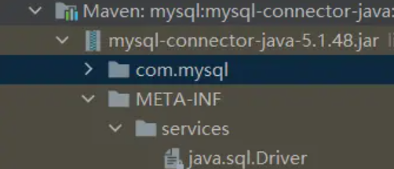
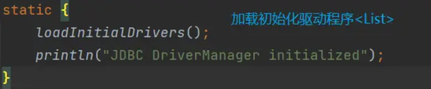
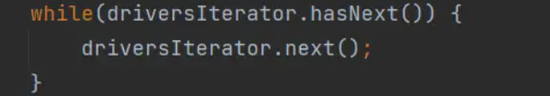
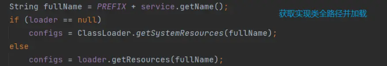
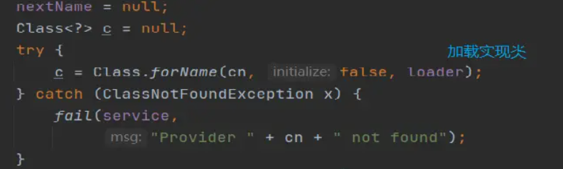
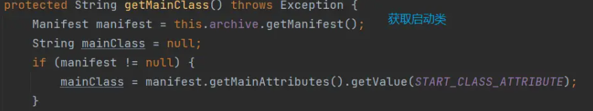
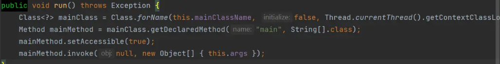

# JDBC-SPI

## 打破背景

为了更加灵活的连接数据库，我们的JDK定义了`Driver`接口，需要与数据库进行连接的包必须实现该接口。例如：MySQL，建议去观察下项目中`mysql-connector`包，下面就有实现类的全限定类名。  

## 打破原因

在上述背景下，执行 `DriverManager`类的方法时，需要去加载实现类。还记得我们第一篇文章讲的 `BootStrapClassLoader`吗，它只能加载`rt.jar`下的类。而MySQL的加载路径隶属于`AppClassLoader`,所以理论上它压根就不能被加载。

于是线程上下文类加载器就应运而生，由于`ThreadClassLoader`一般情况下==`AppClassLoader`。于是通过线程上下文类加载器加载JDBC实现类，打破了双亲委派模型，顺利实现功能。

## 源码解读

1. 查看DriverManager类 

   

2. 获取线程上下文加载器，一般是AppClassLoder，并且Set到ServiceLoader中 

3. 通过迭代器迭代

4. 获取实现类路径配置 = "META-INF/services/" + service.name; 

   

5. 加载实现类 

   

## 不足

ServiceLoader只提供了遍历的方式来获取目标实现类，假如有多个JDBC实现类，都会去加载，没有提供按需加载的方法。像`Dubbo SPI`就提供了可配置化的加载.

# Tomcat

## 打破背景

Tomcat能将多个WebApp应用在一个容器内启动。

## 打破原因

1. Tomcat下有多个WebApp,但它只有一个JVM。不同的WebApp可能会依赖同一个第三方类库的不同版本，因此要保证每个应用程序的类库都是独立的，保证相互隔离。
2. 部署在同一个Tomcat容器中相同的类库相同的版本可以共享。否则，如果服务器有10个应用程序，那么要有10份相同的类库加载进虚拟机。
3. web容器也有自己依赖的类库，不能于应用程序的类库混淆。基于安全考虑，应该让容器的类库和程序的类库隔离开来。 总结：有些共用类只需要一份，有些类只需要多份隔离。

## 实现方式

1. Webapp 应用类加载器每个应用在部署后，都会创建一个唯一的类加载器。该类加载器会加载位于 WEB-INF/lib下的jar文件中的class 和 WEB-INF/classes下的class文件。
2. 通过`Common ClassLoader`加载通用的类。
3. 通过 `Catalina ClassLoader` 加载Tomcat自身需要的类。

# SpringBoot

## 打破背景

`SpringBoot`为了jar包结构的简洁,创建了与普通jar包不一样的包格式

## 打破原因

jar文件规范中，一个jar文件如果要运行必须将入口类放置到jar文件的顶层目录，这样才能被正确的加载。

## 查看源码方法

单纯的SpringBoot项目你找不到启动类的，看这个链接:[点它 ](https://link.juejin.cn?target=https%3A%2F%2Fwww.cnblogs.com%2Ffengpinglangjingruma%2Fp%2F13916297.html)。

## 实现方式

1. 当`java -jar xxx`时，会去调用`JarLauncher.launch()`方法。

2. 获取需要加载的类和包并作为参数传递到LauncherURLClassLoader 

3. 创建类加载器 

4. 获取启动类, 可以看到在我们的项目中Start-Class = "Application.class" 

    

5. 通过自定义加载器加载类，并且反射调用 `Start-Class`的`main`方法启动项目。 

   

# 热加载

## 打破背景

早期的项目，如果修改了代码之后，需要重启项目才能使代码正确运行。

## 打破原因

为了让代码修改后能够快速响应，需要通过热加载的形式，动态发现修改的类，并且使用自定义类加载器快速加载变化的类。

## 实现方式

# Jar包冲突

## 打破背景

项目中经常出现jar包冲突导致抛出异常，不是NoSuchMethod,NoClassDefund。

## 打破原因

Jar包冲突的原因是使用了C2类的方法, 但JVM却加载了C1类。可以让相同包名的包由不同的类加载器加载，进行隔离，避免jar包冲突。

## 实现方式

1. 通过自定义类加载器，为每个中间件自定义一个加载器，这些加载器之间的关系是平行的，彼此没有依赖关系。

2. 这样每个中间件的classloader就可以加载各自版本的包。因为一个类的全限定名以及加载该类的加载器两者共同形成了这个类在JVM中的惟一标识。

   